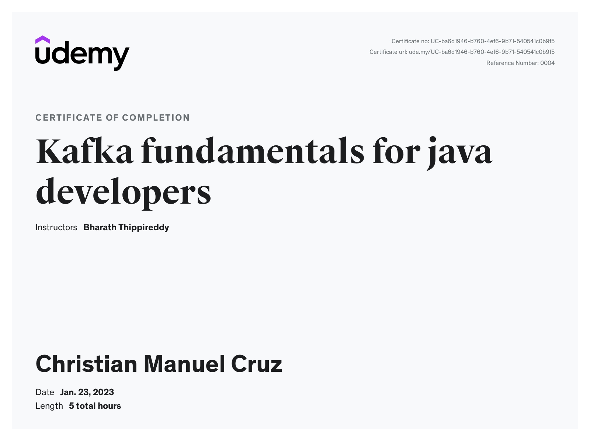

# Kafka Fundamentals

Based on Bharath Thippireddy's udemy course [Kafka Fundamentals](https://www.udemy.com/course/kafka-fundamentals-for-java-developers/).

# Course Completion



- [Kafka Fundamentals](#kafka-fundamentals)
- [Course Completion](#course-completion)
  - [Kafka Installation](#kafka-installation)
  - [Running Confluent Platform](#running-confluent-platform)
  - [Spring Kafka](#spring-kafka)
    - [Producer App](#producer-app)
    - [Consumer App](#consumer-app)
    - [Testing](#testing)
    - [Using a Custom Object Type](#using-a-custom-object-type)
  - [Concepts](#concepts)
    - [Event Streaming](#event-streaming)
    - [Kafka](#kafka)
    - [Usecases](#usecases)
    - [Kafka Architectural Components](#kafka-architectural-components)
    - [Kafka Record](#kafka-record)
    - [Consumer Groups](#consumer-groups)
    - [Batching](#batching)
  - [Kafka Producer API](#kafka-producer-api)
  - [Kafka Consumer API](#kafka-consumer-api)
  - [Custom Serializer and Deserializer](#custom-serializer-and-deserializer)
  - [Avro](#avro)
    - [GenericRecord](#genericrecord)
  - [Creating Custom Partitioner](#creating-custom-partitioner)
  - [ProducerConfig](#producerconfig)
    - [ACKS\_CONFIG](#acks_config)
    - [BUFFER\_MEMORY\_CONFIG](#buffer_memory_config)
    - [COMPRESSION\_TYPE\_CONFIG](#compression_type_config)
    - [RETRIES\_CONFIG](#retries_config)
    - [RETRY\_BACKOFF\_MS\_CONFIG](#retry_backoff_ms_config)
    - [BATCH\_SIZE\_CONFIG](#batch_size_config)
    - [LINGER\_MS\_CONFIG](#linger_ms_config)
    - [REQUEST\_TIMEOUT\_MS\_CONFIG](#request_timeout_ms_config)
  - [Message Delivery](#message-delivery)
    - [At Least Once](#at-least-once)
    - [At Most Once](#at-most-once)
    - [Only Once](#only-once)
  - [Transactions](#transactions)
  - [Consuemr Groups](#consuemr-groups)
    - [Rebalancing](#rebalancing)
    - [Offset Commits](#offset-commits)
    - [Auto Commit](#auto-commit)
    - [Custom Commit Offset](#custom-commit-offset)
    - [Rebalance Listeners](#rebalance-listeners)
  - [ConsuemrConfig](#consuemrconfig)
    - [FETCH\_MIN\_BYTES\_CONFIG](#fetch_min_bytes_config)
    - [FETCH\_MAX\_WAIT\_MS\_CONFIG](#fetch_max_wait_ms_config)
    - [HEARTBEAT\_INTERVAL\_MS\_CONFIG](#heartbeat_interval_ms_config)
    - [SESSION\_TIMEOUT\_MS\_CONFIG](#session_timeout_ms_config)
    - [MAX\_PARTITION\_FETCH\_BYTES\_CONFIG](#max_partition_fetch_bytes_config)
    - [AUTO\_OFFSET\_RESET\_CONFIG](#auto_offset_reset_config)
    - [CLIENT\_ID\_CONFIG](#client_id_config)
    - [MAX\_POLL\_RECORDS\_CONFIG](#max_poll_records_config)
  - [Simple Consumer](#simple-consumer)
  - [Real Time Stream Processing](#real-time-stream-processing)
    - [Setting up the Project](#setting-up-the-project)
    - [Configuring Properties](#configuring-properties)
    - [Creating Topology](#creating-topology)
    - [Starting and Closing Stream](#starting-and-closing-stream)
    - [Testing](#testing-1)
    - [Writing to Output Topic](#writing-to-output-topic)
  - [WordCount Usecase](#wordcount-usecase)
    - [KTable](#ktable)
    - [flatMap](#flatmap)
    - [Testing](#testing-2)

## Kafka Installation

After downloading the Kafka tgz package, we need to extract the tar file, and then extract it again. The `bin/windows` directory contains the batch files for running Kafka. The `config` folder contains all the necessary configuration properties. To start zookeeper in port 2181 and Kafka broker in port 9092:

```bash
zookeeper-server-start C:\kafka\config\zookeeper.properties
kafka-server-start C:\kafka\config\server.properties
```

We can create a topic using

```bash
kafka-topics --create --bootstrap-server localhost:9092 --replication-factor 1 --partitions 1 --topic first-topic
kafka-topics --describe --bootstrap-server localhost:9092 --topic first-topic
```

We can start setting up a consumer using

```bash
kafka-console-consumer --bootstrap-server localhost:9092 --topic first-topic
```

and produce messages using

```bash
kafka-console-producer --broker-list localhost:9092 --topic first-topic
> Hello World!
```

## Running Confluent Platform

https://docs.confluent.io/platform/current/platform-quickstart.html#step-1-download-and-start-cp

1. Create a docker-compose.yml from the [repo](https://github.com/confluentinc/cp-all-in-one/tree/7.3.1-post/cp-all-in-one/docker-compose.yml).
2. Start the Confluent Platform stack

```bash
docker-compose up -d
```

3. Verify that the services are up and running:

```bash
docker-compose ps
```

To restart the containers:

```bash
docker-compose restart name
```

## Spring Kafka

An abstraction on top of the kafka-clients library and makes creating producers and consumers easily. The necessary dependencies for the sample project are Spring Web and Spring for Apache Kafka. Spring supports inbuilt JSON serializer that we can use on our custom User object.

```java
public class User {
	private String name;
	private int age;
	private String favGenre;
}
```

### Producer App

```properties

spring.kafka.producer.bootstrap-servers=localhost:9092
spring.kafka.producer.key-serializer=org.apache.kafka.common.serialization.StringSerializer
spring.kafka.producer.value-serializer=org.springframework.kafka.support.serializer.JsonSerializer
```

```java
@Service
public class UserProducerService {

	@Autowired
	private KafkaTemplate<String, User> kafkaTemplate;

	public void sendUserData(User user) {
		kafkaTemplate.send("user-topic", user.getName(), user);
	}
}
```

The rest controller will be as follows

```java
@RestController
@RequestMapping("/userapi")
public class UserController {
	@Autowired
	private UserProducerService service;

	@PostMapping("/publishuserdata")
	public void sendUserData(@RequestBody User user) {
		service.sendUserData(user);
	}
}
```

### Consumer App

```properties
spring.kafka.consumer.bootstrap-servers=localhost:9092
spring.kafka.consumer.key-deserializer=org.apache.kafka.common.serialization.StringDeserializer
spring.kafka.consumer.value-deserializer=org.springframework.kafka.support.serializer.JsonDeserializer
spring.kafka.consumer.properties.spring.json.trusted.packages=com.demiglace.kafka.dto
spring.kafka.consumer.group-id=user-group
server.port=8085
```

```java
@Service
public class UserConsumerService {
	@KafkaListener(topics= {"user-topic"})
	public void consumeUserData(User user) {
		System.out.println("Received person age: " + user.getAge());
		System.out.println("Favorite genre: " + user.getFavGenre());
	}
}
```

### Testing

To test the app, send a POST request with a JSON body to `http://localhost:8080/userapi/publishuserdata`.

```json
{
  "name": "Doge",
  "age": 23,
  "favGenre": "Supernatural"
}
```

### Using a Custom Object Type

We can create a User POJO

## Concepts

### Event Streaming

- Capturing data in real time from envent sources like databases, sensors, etc.
- Ensures a continuous flow and interpretation of data

### Kafka

- A distributed commit log / streaming platform used to collect process store and integrate data at scale
- Processes streams of data in a scalable and fault tolerant matter
- The data and events can be processed as soon as it is produced making Kafka ideal for analytics
- Supports multiple producers and consumers
- In Kafka, a message is retained and another consumer can process it as well
- Kafka supports consumer groups and partitions for parallel processing
- Kafka ensures that for a consumer group, a message will be consumed only once
- Kafka supports disk based persistence in the event that a consumer is down

### Usecases

- PubSub messaging
- Producer-Consumer pattern
- Activity Tracking
- Metrics and Log Aggregation
- Commit Logging
- Stream Processing
- Data Pipelines
- Big Data

### Kafka Architectural Components

1. Broker

- A Kafka cluster is a collection of Kafka brokers/nodes
- Through these brokers, messages are exchanged between producers and consumers
- Decouples producers and consumers
- Ensures that messages are persisted and durable
- One of the brokers is elected as a cluster leader responsible for managing partitions

2. ZooKeeper

- Responsible for electing a cluster controller/leader
- All broker nodes register themselves to the ZooKeeper
- Maintains the state of the cluster

3. Producers

- Application that produces data
- Communicates with the cluster using TCP
- Can send messages to multiple topics, and a topic can receive from multiple producers

4. Consumers

- Appplication that consumes from one or more topics and processes it
- Coordinates among themselves to balance load

### Kafka Record

The producer applications create and exchange data using [Kafka Records](https://kafka.apache.org/23/javadoc/org/apache/kafka/clients/producer/ProducerRecord.html). It has seven properties:

1. Topic - topic to which this record should be returned to. Each topic can be divided into one or more partitions
2. Partition - zero based index to which the record is to be written. A record is always associated with only one partition. Partitions can be scaled across brokers
3. Offset - 64 bit signed int for locating a record within a partition
4. Timestamp - Timestamp of the record
5. Key - Optional non unique value used for calculating the partition number
6. Headers - Optional key value pair for passing in metadata
7. Value - Where the payload lies

### Consumer Groups

A set of consumers working together to consume a topic. It ensures that each partition is only consumed by one consumer. Assigning a consumer to a partition is called **ownership**.

### Batching

A batch is a collection of messages that should be written to the same topic and partition. Kafka producers batches messages based on the topic and partition.

## Kafka Producer API

To create a Producer, we create an instance of the **KafkaProducer** class which takes a key value and properties on the constructor. The **bootstrap.servers** property is a list of brokers the producer should connect to. The **key.serializer** and **value.serializer** are classes for converting java objects into bytes so that the kafka broker can understand it.

The Record object will represent the message with the key, value and the topic it should be sent to. The send method is returns a Future<RecordMetadata> which we can wait for on a synchronous send.

```java
public class OrderProducer {
	public static void main(String[] args) {
		// create properties
		Properties props = new Properties();
		props.setProperty("bootstrap.servers", "localhost:9092");
		props.setProperty("key.serializer", "org.apache.kafka.common.serialization.StringSerializer");
		props.setProperty("value.serializer", "org.apache.kafka.common.serialization.IntegerSerializer");

		// create the producer
		KafkaProducer<String,Integer> producer = new KafkaProducer<String, Integer>(props);
		ProducerRecord<String, Integer> record = new ProducerRecord<>("OrderTopic", "Macbook Pro", 10);

		try {
			// send message
			Future<RecordMetadata> future = producer.send(record);
			RecordMetadata recordMetadata = future.get();
			System.out.println("Message sent!");
			System.out.println(recordMetadata.partition());
			System.out.println(recordMetadata.offset());
		} catch (Exception e) {
			e.printStackTrace();
		} finally {
			producer.close();
		}
	}
}
```

If we want to send a message asynchronously, we need to add a callback parameter to the send() method that implements the Callback interface.

```java
		try {
			producer.send(record, new OrderCallback()); // async send
		}
```

```java
public class OrderCallback implements Callback {
	@Override
	public void onCompletion(RecordMetadata recordMetadata, Exception exception) {
		System.out.println("Message sent!");
		System.out.println(recordMetadata.partition());
		System.out.println(recordMetadata.offset());
	}
}
```

## Kafka Consumer API

To create a consumer, we pass the properties to **KafkaConsumer**. The consumer needs the **group.id** property in addition to key.deserializer, value.deserializer and bootstrap.servers. A consumer can subscribe to multiple topics. Once subscribed, we need to invoke the **poll()** method to start polling the topic for messages.

```java
public class OrderConsumer {

	public static void main(String[] args) {
		Properties props = new Properties();
		props.setProperty("bootstrap.servers", "localhost:9092");
		props.setProperty("key.deserializer", "org.apache.kafka.common.serialization.StringDeserializer");
		props.setProperty("value.deserializer", "org.apache.kafka.common.serialization.IntegerDeserializer");
		props.setProperty("group.id", "OrderTopic");

		// create the consumer
		KafkaConsumer<String, Integer> consumer = new KafkaConsumer<>(props);
		consumer.subscribe(Collections.singletonList("OrderTopic"));

		// poll the topic
		ConsumerRecords<String, Integer> orders= consumer.poll(Duration.ofSeconds(20));

		for (ConsumerRecord<String, Integer> order : orders) {
			System.out.println("Product Name: " + order.key());
			System.out.println("Product Quantity: " + order.value());
		}

		consumer.close();
	}
}
```

## Custom Serializer and Deserializer

Custom serializer and deserializers are needed when working with custom object types to convert these objects into byte array. We can use jackson-databind **ObjectMapper** to convert from/into string then into/from bytes.

```java
public class OrderSerializer implements Serializer<Order> {

	@Override
	public byte[] serialize(String topic, Order order) {
		byte[] response = null;
		// serialization logic
		ObjectMapper objectMapper = new ObjectMapper();
		try {
			response = objectMapper.writeValueAsString(order).getBytes();
		} catch (JsonProcessingException e) {
			e.printStackTrace();
		}
		return response;
	}
}
```

```java
public class OrderDeserializer implements Deserializer<Order> {
	@Override
	public Order deserialize(String topic, byte[] data) {
		Order order = null;
		ObjectMapper objectMapper = new ObjectMapper();
		try {
			order = objectMapper.readValue(data, Order.class);
		} catch (IOException e) {
			e.printStackTrace();
		}
		return order;
	}
}
```

```java
public class OrderProducer {
	public static void main(String[] args) {
		// create properties
		Properties props = new Properties();
		props.setProperty("bootstrap.servers", "localhost:9092");
		props.setProperty("key.serializer", "org.apache.kafka.common.serialization.StringSerializer");
		props.setProperty("value.serializer", "com.demiglace.kafka.orderproducer.customserializers.OrderSerializer");

		// create the producer
		KafkaProducer<String,Order> producer = new KafkaProducer<String, Order>(props);
		Order order = new Order();
		order.setCustomerName("Doge");
		order.setProduct("Macbook");
		order.setQuantity(10);
		ProducerRecord<String, Order> record = new ProducerRecord<>("OrderCSTopic", order.getCustomerName(), order);

		try {
			// send message
			producer.send(record); // synchronous
		} catch (Exception e) {
			e.printStackTrace();
		} finally {
			producer.close();
		}
	}
}
```

```java
public class OrderConsumer {
	public static void main(String[] args) {
		Properties props = new Properties();
		props.setProperty("bootstrap.servers", "localhost:9092");
		props.setProperty("key.deserializer", StringDeserializer.class.getName());
		props.setProperty("value.deserializer", OrderDeserializer.class.getName());
		props.setProperty("group.id", "OrderTopic");

		// create the consumer
		KafkaConsumer<String, Order> consumer = new KafkaConsumer<>(props);
		consumer.subscribe(Collections.singletonList("OrderCSTopic"));

		// poll the topic
		ConsumerRecords<String, Order> records = consumer.poll(Duration.ofSeconds(20));

		for (ConsumerRecord<String, Order> record : records) {
			String customerName = record.key();
			Order order = record.value();
			System.out.println("Product: " +  order.getProduct());
		}

		consumer.close();
	}
}
```

## Avro

Apache Avro is a framework that can serialize and deserialize objects out of the box, we just need to define a JSON schema. We can also use this schema to generate a java class. Each record that is produces will comply to the schema. As different consumers might need different versions of a schema, we can use Schema registries such as Confluent's schema registry at port 8081.

An Avro (.avsc) schema uses JSON syntax. The **namespace** will be used for the package name and the **name** for the class name. The Order POJO will be created by the avro-maven-plugin from this schema, which will include annotations from avro.

```json
{
  "namespace": "com.demiglace.kafka.avro",
  "type": "record",
  "name": "Order",
  "fields": [
    {
      "name": "customerName",
      "type": "string"
    },
    {
      "name": "product",
      "type": "string"
    },
    {
      "name": "quantity",
      "type": "int"
    }
  ]
}
```

To use avro, we need the following plugins. The Order class will be generated after doing a maven generate-sources

```xml
<repositories>
	<repository>
		<id>confluent</id>
		<url>http://packages.confluent.io/maven/</url>
		<releases>
			<enabled>true</enabled>
		</releases>
		<snapshots>
			<enabled>true</enabled>
		</snapshots>
	</repository>
</repositories>

<dependency>
	<groupId>org.apache.avro</groupId>
	<artifactId>avro</artifactId>
	<version>1.10.2</version>
</dependency>
<dependency>
	<groupId>io.confluent</groupId>
	<artifactId>kafka-avro-serializer</artifactId>
	<version>6.2.0</version>
</dependency>

<build>
	<plugins>
		<plugin>
			<groupId>org.apache.avro</groupId>
			<artifactId>avro-maven-plugin</artifactId>
			<version>1.10.2</version>
			<executions>
				<execution>
					<phase>generate-sources</phase>
					<goals>
						<goal>schema</goal>
					</goals>
					<configuration>
						<sourceDirectory>${project.basedir}/src/main/resources/</sourceDirectory>
						<outputDirectory>${project.basedir}/src/main/java</outputDirectory>
					</configuration>
				</execution>
			</executions>
		</plugin>
	</plugins>
</build>
```

Avro Serializers will automatically push the schema into the registry. For the producer properties, we use the following

```java
		props.setProperty("bootstrap.servers", "localhost:9092");
		props.setProperty("key.serializer", KafkaAvroSerializer.class.getName());
		props.setProperty("value.serializer", KafkaAvroSerializer.class.getName());
		props.setProperty("schema.registry.url", "http://localhost:8081");

ProducerRecord<String, Order> record = new ProducerRecord<>("OrderAvroTopic", order.getCustomerName().toString(), order);
```

For the consumer, we use the following.

```java
		props.setProperty("bootstrap.servers", "localhost:9092");
		props.setProperty("key.deserializer", KafkaAvroDeserializer.class.getName());
		props.setProperty("value.deserializer", KafkaAvroDeserializer.class.getName());
		props.setProperty("group.id", "OrderGroup");
		props.setProperty("schema.registry.url", "http://localhost:8081");
		props.setProperty("specific.avro.reader", "true");
```

The schema will automatically be uploaded by the producer to `http://localhost:8081/schemas`.

### GenericRecord

Avro supports specific readers for specific types, such as our Order type but avro also supports GenericRecord types. We just need to parse a schema and

```java
KafkaProducer<String, GenericRecord> producer = new KafkaProducer<>(props);
		Parser parser = new Schema.Parser();
		Schema schema = parser.parse(file);
		GenericRecord order = new GenericData.Record(schema);
		order.put("customerName", "doge");
		order.put("product", "Macbook");
		order.put("quantity", 100);

		ProducerRecord<String, GenericRecord> record = new ProducerRecord<>("OrderAvroGRTopic",
				order.get("customerName").toString(), order);


		// create the consumer
		KafkaConsumer<String, GenericRecord> consumer = new KafkaConsumer<>(props);
		consumer.subscribe(Collections.singletonList("OrderAvroGRTopic"));

		// poll the topic
		ConsumerRecords<String, GenericRecord> records = consumer.poll(Duration.ofSeconds(20));

		for (ConsumerRecord<String, GenericRecord> record : records) {
			String customerName = record.key();
			GenericRecord order = record.value();
			System.out.println("Product: " +  order.get("product"));
		}
```

## Creating Custom Partitioner

We start by manually creating a topic with 10 partitions using the broker node.

```bash
kafka-topics --create --bootstrap-server localhost:9092 --replication-factor 1 --partitions 10 --topic OrderPart
itionedTopic
kafka-topics --describe --bootstrap-server localhost:9092 --topic OrderPartitionedTopic
```

The custom partitioner class implements **Partitioner** from kafka. The partitioning logic uses a murmur2 algorithm. In the following example, A "Doge" key will be put into partition 5. Otherwise, it will be returned based on the murmur hashing algorithm.

```java
public class VIPPartitioner implements Partitioner {
	@Override
	public int partition(String topic, Object key, byte[] keyBytes, Object value, byte[] valueBytes, Cluster cluster) {
		List<PartitionInfo> partitions = cluster.availablePartitionsForTopic(topic);
		// logic for implementing partitioning
		if (((String)key).equals("Doge")) {
			return 5;
		}
		return (Math.abs(Utils.murmur2(keyBytes))%partitions.size() - 1 );
	}
}
```

We can then set the partitioner.class property on the producer.

```java
props.setProperty("partitioner.class", VIPPartitioner.class.getName());
```

## ProducerConfig

Instead of hardcoding the properties, we can use the kafka ProducerConfig class.

```java
		Properties props = new Properties();
		props.setProperty(ProducerConfig.BOOTSTRAP_SERVERS_CONFIG, "localhost:9092");
		props.setProperty(ProducerConfig.KEY_SERIALIZER_CLASS_CONFIG, "org.apache.kafka.common.serialization.StringSerializer");
		props.setProperty(ProducerConfig.VALUE_SERIALIZER_CLASS_CONFIG, "org.apache.kafka.common.serialization.IntegerSerializer");
		props.setProperty(ProducerConfig.ACKS_CONFIG, "all");
		props.setProperty(ProducerConfig.BUFFER_MEMORY_CONFIG, "123123");
		props.setProperty(ProducerConfig.COMPRESSION_TYPE_CONFIG, "gzip");
		props.setProperty(ProducerConfig.RETRIES_CONFIG, "2");
		props.setProperty(ProducerConfig.RETRY_BACKOFF_MS_CONFIG, "500");
		props.setProperty(ProducerConfig.BATCH_SIZE_CONFIG, "1000000");
		props.setProperty(ProducerConfig.LINGER_MS_CONFIG, "500");
		props.setProperty(ProducerConfig.REQUEST_TIMEOUT_MS_CONFIG, "200");
```

### ACKS_CONFIG

The ACKS*CONFIG property can have either \_0*, _1_ or _all_ as its value. This controls how many partitions should receive a message before the producer considers a successful send.

### BUFFER_MEMORY_CONFIG

A byte value which the producer will use to buffer the messages before it sends to the broker. By default, it is 256 Mb.

### COMPRESSION_TYPE_CONFIG

By default, sent messages are not compressed. The possible values are _snappy_, _gzip_, _lz4_.

### RETRIES_CONFIG

The amount of times to retry sending a message. If set to 0, it will never retry. The producer will not retry if there is an unrecoverable exception.

### RETRY_BACKOFF_MS_CONFIG

The duration between retries. By default, it waits for 100ms before retrying sending.

### BATCH_SIZE_CONFIG

Memory size to be allocated to a batch in bytes. Defaults to 16kb. By default, the producer doesn't wait for the batch memory to be filled with messages and will hand over the message as soon as a sender thread is available.

### LINGER_MS_CONFIG

The time for a producer to wait before handing over a message to the sender thread.

### REQUEST_TIMEOUT_MS_CONFIG

Time in milliseconds for a producer to wait for a response from the broker

## Message Delivery

Kafka supports three message delivery semantics:

1. At Least Once
2. At Most Once
3. Only Once/Idempotency

### At Least Once

Default option. If the emssage is received by the broker and once the partitions (leader and follower) have received the message, the broker treats it as committed and sends an acknowledgement back to the producer. The disadvantage is that if the acknowledgement fails, the producer API will resend the same message.

### At Most Once

A message should be delivered at most once. The producer will not retry sending a message. This is achieved by setting retries to 0.

### Only Once

No duplication of messages by setting enable.idempotence to true. The producer send method generates a unique sequence number for every message that is unique for every partition. The broker maintains the message sequence number and produces a unique producer ID for each producer instance.

```java
props.setProperty(ProducerConfig.ENABLE_IDEMPOTENCE_CONFIG, "true");
```

## Transactions

A transaction is where we commit all records or roll back everything when an exception occurs. By setting TRANSACTIONAL_ID_CONFIG, every producer instance should have a unique id. The KafkaProducer **initTransactions()** method ensures that any transactions initiated by previous isntances of the producer with the same transactional.id are completed. If the previous instance has failed, it will abort. If the last transaction is not yet finished, this will await its completion. We need to set the max.block.ms property as well to prevent blocking.

It is important to note that when using transactions, we don't need to pass a callback to the send() method. Producers are thread safe, meaning we can invoke the send() method from multiple threads but the same producer instance cannot have multiple transactions open at the same time. The commitTransaction() method will flush any unsent record before the commit happens.

```java
public class TransactionalOrderProducer {
	public static void main(String[] args) {
		props.setProperty(ProducerConfig.TRANSACTIONAL_ID_CONFIG, "order-produicer-1");
		// props.setProperty(ProducerConfig.MAX_BLOCK_MS_CONFIG, "1000");

		// create the producer
		KafkaProducer<String,Integer> producer = new KafkaProducer<String, Integer>(props);
		producer.initTransactions();
		ProducerRecord<String, Integer> record = new ProducerRecord<>("OrderTopic", "Macbook Pro", 10);
		ProducerRecord<String, Integer> record2 = new ProducerRecord<>("OrderTopic", "Legion", 20);

		try {
			producer.beginTransaction();
			producer.send(record);
			producer.send(record2);
			producer.commitTransaction();
		} catch (Exception e) {
			producer.abortTransaction();
			e.printStackTrace();
		} finally {
			producer.close();
		}
	}
}
```

## Consuemr Groups

A consumer group is a group of consumers that can read from the same topic, but different partitions in a topic. If there are more consumers than partitions, some consumers will be left in an idle state. Using consumer groups, we can have multiple applications consume from the same topic.

### Rebalancing

Consumer Group Rebalancing is the process of moving partition ownership from one consumer to another in the group. This provides high availability, however, when a rebalance occurs, all the consumers in the group will go silent while the rebalance is happening. The group leader is the one that does the rebalancing whereas the consumer sends a heartbeat to the group leader.

### Offset Commits

Kafka doesn't keep track of which offset a consumer has reached or how many has already been processed. Offset Commits can be used so that the consumers can commit the offsets already processed into the **\_\_consumer_offsets** topic so that when a rebalance occurs, the new consumer assigned to the partition will know which offsets have been processed.

### Auto Commit

By default, auto commits are enabled. We can disable it with the "enable.auto.commit" property. The default interval for an auto commit to happen is 5s. When the poll() method is invoked for the very first time, it sets a timer for the auto commit and the next time the poll() is invoked, the poll will check if the 5s has elapsed and only then it will commit the previous offset. If not, it will process the next set of offset. We can set the interval using the auto.commit.interval.ms property.

We can use the **ConsumerRecords.commitSync()** to manually commit the entire current offset. However, this blocks the consumer application until the broker responds back to the commit request. Using **commitAsync()**, the current offset will be sent to the broker and the next offset will be retrieved while the commit is still in progress. This however doesn't support retries if the commit fails. We can pass a **OffsetCommitCallback()** which invokes a method when a commit finishes.

### Custom Commit Offset

```java
				int count = 0;

				for (ConsumerRecord<String, Order> record : records) {
					// business logic here

					// commit every 10 records
					if (count % 10 == 0) {
						consumer.commitAsync(
								Collections.singletonMap(new TopicPartition(record.topic(), record.partition()),
										new OffsetAndMetadata(record.offset() + 1)),
								new OffsetCommitCallback() {

									@Override
									public void onComplete(Map<TopicPartition, OffsetAndMetadata> offsets,
											Exception exception) {
										if (exception != null) {
											System.out.println("Commit failed for offset: " + offsets);
										}
									}
								});
					}
					count++;
				}
```

### Rebalance Listeners

We can pass a ConsumerRebalanceListener on our **KafkaConsumer.subscribe()** method to perform methods when a rebalance is triggered. **onPartitionsRevoked()** is triggered before the partitions are revoked. This is the place to commit offsets and cleanup the consumer before partitions are lost.

```java
consumer.subscribe(Collections.singletonList("OrderPartitionedTopic"), new RebalanceHandler());
```

```java
		class RebalanceHandler implements ConsumerRebalanceListener {

			@Override
			public void onPartitionsRevoked(Collection<TopicPartition> partitions) {
				consumer.commitSync(currentOffsets);
			}

			@Override
			public void onPartitionsAssigned(Collection<TopicPartition> partitions) {
				// TODO Auto-generated method stub

			}

		}
```

## ConsuemrConfig

### FETCH_MIN_BYTES_CONFIG

Tells the kafka broker to wait until the threshold is reached before sending data to the consumer. It defaults at 1MB.

### FETCH_MAX_WAIT_MS_CONFIG

Defaults to 500ms, which is the time the Kafka broker waits before sending data.

### HEARTBEAT_INTERVAL_MS_CONFIG

The interval for the consumer to send a heartbeat to the coordinator.

### SESSION_TIMEOUT_MS_CONFIG

Tells the broker for how long a consumer can run without sending a heartbeat. Usually set to 3x the heartbeat interval.

### MAX_PARTITION_FETCH_BYTES_CONFIG

Maximum number of bytes of data per partition the broker returns to the consumer.

### AUTO_OFFSET_RESET_CONFIG

Defines the consumer behavior if it starts reading a partition thatdoesn't have a committed offset. If set to latest, the consumer will start reading the latest records and ignore the previous records. earliest is where the consumer processes all the records from the beginning of the partition.

### CLIENT_ID_CONFIG

Used by the broker for logging metrics

### MAX_POLL_RECORDS_CONFIG

Maximum number of records the poll() method can return.

## Simple Consumer

A Simple Consumer is a standalone consumer that does not belong to a consumer group. This does not have rebalancing, etc. We can use the KafkaConsumer.assign() method to assign a consumer to a list of partitions

```java
props.setProperty(ConsumerConfig.AUTO_OFFSET_RESET_CONFIG, "earliest");

		// create the consumer
		KafkaConsumer<String, Integer> consumer = new KafkaConsumer<>(props);
		// assign all partitions from a given topic
		List<PartitionInfo> partitionInfos = consumer.partitionsFor("SimpleConsumerTopic");
		ArrayList<TopicPartition> partitions = new ArrayList<>();
		// partitions.add(new TopicPartition("SimpleConsumerTopic", 0)); // assign to specific partitions
		// partitions.add(new TopicPartition("SimpleConsumerTopic", 1)); // assign to specific partitions

		for (PartitionInfo info : partitionInfos) {
			partitions.add(new TopicPartition("SimpleConsumerTopic", info.partition()));
		}
		consumer.assign(partitions);

		// poll the topic
		ConsumerRecords<String, Integer> orders= consumer.poll(Duration.ofSeconds(20));
```

## Real Time Stream Processing

In big data systems, the data are stored in Data Lakes to be pulled and used by tools for near-real time processing. Data Streaming on the other hand is a continuous flow of data as the data stream doesn't get stored into data lakes/databases. As the stream is processed aggregation, analytics, etc can be performed in real time.

The Kafka Streams Library is divided into two:

1. Streams DSL (Domain Specific Language)
2. Processor API

In this section, the use case will be a data streaming application where data will flow as a stream from an input topic, get transformed and flow out into an output topic.

Steps to create a streaming application:

1. Configure Properties
2. Define topology
3. Start the Stream

### Setting up the Project

```bash
kafka-topics --create --bootstrap-server localhost:9092 --replication-factor 1 --partitions 1 --topic streams-dataflow-input

kafka-topics --create --bootstrap-server localhost:9092 --replication-factor 1 --partitions 1 --topic streams-dataflow-output
```

The project will use maven-archetype-quickstart with the kafka-streams dependency which transitively pulls kafka-clients as well.

### Configuring Properties

Every streaming application should have a unique id.

```java
		Properties props = new Properties();
		props.put(StreamsConfig.APPLICATION_ID_CONFIG, "streams-dataflow");
		props.put(StreamsConfig.BOOTSTRAP_SERVERS_CONFIG, "localhost:9092");
		props.put(StreamsConfig.DEFAULT_KEY_SERDE_CLASS_CONFIG, Serdes.String().getClass().getName());
		props.put(StreamsConfig.DEFAULT_VALUE_SERDE_CLASS_CONFIG, Serdes.String().getClass().getName());
```

### Creating Topology

The stream topology is where the computational logic resides. We pass a lambda expression to the Stream.foreach() method.

```java
		StreamsBuilder builder = new StreamsBuilder();
		KStream<String, String> stream = builder.stream("streams-dataflow-input");
    // computational logic
		stream.foreach((key,value) -> System.out.println("key " + key + " value " + value));
		Topology topology = builder.build();
    System.out.println(topology.describe());
```

We can see a description of the topology using **Topology.describe()**

```bash
Topologies:
   Sub-topology: 0
    Source: KSTREAM-SOURCE-0000000000 (topics: [streams-dataflow-input])
      --> KSTREAM-FOREACH-0000000001
    Processor: KSTREAM-FOREACH-0000000001 (stores: [])
      --> none
      <-- KSTREAM-SOURCE-0000000000
```

### Starting and Closing Stream

```java
		// starting the stream
		KafkaStreams streams = new KafkaStreams(topology, props);
		streams.start();

		// stopping the stream through the current runtime
		Runtime.getRuntime().addShutdownHook(new Thread(streams::close));
```

### Testing

The kafka-console-producer command will produce a message on to the streams-dataflow-input topic

```bash
kafka-console-producer --bootstrap-server localhost:9092 --topic streams-dataflow-input
```

### Writing to Output Topic

```java
    stream.foreach((key,value) -> System.out.println("key " + key + " value " + value));
		KStream<String,String> filteredStream = stream.filter((key,value) -> value.contains("token"));
		filteredStream.to("streams-dataflow-output");
```

Some KStream methods returns a value. This way, we can chain stream methods.

```java
		stream.foreach((key, value) -> System.out.println("key " + key + " value " + value));
		stream.filter((key, value) -> value.contains("token"))
			.mapValues(value->value.toUpperCase())
			.to("streams-dataflow-output");
```

## WordCount Usecase

```bash
kafka-topics --create --bootstrap-server localhost:9092 --replication-factor 1 --partitions 1 --topic streams-wordcount-input

kafka-topics --create --bootstrap-server localhost:9092 --replication-factor 1 --partitions 1 --topic streams-wordcount-output
```

```java
		// computational logic
		// take incoming message and convert each word into key (null) value (word) pairs
		// group by value, new stream will have the value as the new key
		KGroupedStream<String,String> kGroupedStream = stream.flatMapValues(value->Arrays.asList(value.toLowerCase().split(" ")))
			.groupBy((key, value) -> value);
		KTable<String,Long> countsTable = kGroupedStream.count();
		countsTable.toStream()
		// override the default string to LONG
			.to("streams-wordcount-output", Produced.with(Serdes.String(), Serdes.Long()));
```

### KTable

A stateful component which represents of an update stream (changelog). As the records flow through the stream, it maintains the updates for the records with the same key. When the next identical message arrives, we increment the values from the earlier through an upsert operation.

### flatMap

Can return multiple records back as opposed to Map.

### Testing

To test, we run the following on the producer terminal

```bash
kafka-console-producer --bootstrap-server localhost:9092 --topic streams-wordcount-input
```

and the consumer terminal

```bash
kafka-console-consumer --bootstrap-server localhost:9092 \
    --topic streams-wordcount-output \
    --from-beginning \
    --property print.key=true \
    --property print.value=true \
    --property key.deserializer=org.apache.kafka.common.serialization.StringDeserializer \
    --property value.deserializer=org.apache.kafka.common.serialization.LongDeserializer
```
